# TRƯỜNG ĐẠI HỌC SƯ PHẠM – ĐẠI HỌC ĐÀ NẴNG
## KHOA TOÁN – TIN
### HỌC PHẦN: THIẾT KẾ VÀ LẬP TRÌNH WEB (HỌC KỲ 1, NĂM HỌC 2026 – 2027)

---

# BÁO CÁO BÀI TẬP THỰC HÀNH NHÓM SỐ 4
## CHƯƠNG 4: JAVASCRIPT VÀ LẬP TRÌNH PHÍA MÁY KHÁCH
*Đề tài: Phân tích JavaScript của website ued.udn.vn và thêm tương tác, dữ liệu động cho website đồ án BookNest*

**Nhóm thực hiện: NHÓM 12 — Lớp sinh hoạt: 24CNTT3**

### 👥 DANH SÁCH THÀNH VIÊN NHÓM 12
1. **Xaiyasith Yoi** – MSV: **3120224189** (Nhóm trưởng)
2. **Phommaket Hatsady** – MSV: **3120224181** (Thành viên)
3. **Vongsena Sauphasith** – MSV: **3120224186** (Thành viên)
4. **Nguyễn Thị Sinh** – MSV: **3120223169** (Thành viên)

- **Kho GitHub của nhóm:** `https://github.com/xys-3y7/ltweb-doan-nhom12`
- **Địa chỉ website xem trực tiếp (GitHub Pages):** `https://xys-3y7.github.io/ltweb-doan-nhom12/`
- **Mã commit kiểm tra (Last Commit SHA):** `ce55ea7d7f70e8a7c243b23688eb595e3710e987`
- **Thời gian hoàn thành kiểm chuẩn:** Tháng 09/2026 (Trước buổi thực hành Tuần 7)

---

# PHẦN A – PHÂN TÍCH JAVASCRIPT CỦA MỘT WEBSITE THỰC TẾ (UED.UDN.VN)

Nhóm 12 tiếp tục sử dụng website thực tế của Trường Đại học Sư phạm – Đại học Đà Nẵng (địa chỉ: `https://ued.udn.vn`), nền tảng đã được khảo sát ở Bài tập nhóm số 2 (HTML5) và Bài tập nhóm số 3 (CSS3 & Responsive). Sử dụng bộ công cụ Chrome DevTools (các tab Network, Elements – Event Listeners, Application, Console) và Lighthouse, nhóm tiến hành khảo sát chuyên sâu về kiến trúc kịch bản JavaScript, các luồng tương tác sự kiện, cơ chế nạp dữ liệu động và lưu trữ phía máy khách.

## 1. Khảo sát tệp JavaScript, thư viện và framework sử dụng
Tại tab Network của Chrome DevTools trên trang chủ (chế độ Disable Cache, tải lại trang, kích hoạt bộ lọc JS), kết quả ghi nhận trang nạp tổng cộng 9 tệp JavaScript với tổng dung lượng tải về là **466.8 KB** (thời gian nạp trung bình 780 ms qua mạng mô phỏng 4G). Chi tiết các tệp được tổng hợp tại Bảng A.1:

### Bảng A.1. Danh mục các tệp JavaScript nạp tại trang chủ ued.udn.vn
| STT | Tên tệp kịch bản (.js) | Vai trò / Thư viện nhận diện | Dung lượng (KB) | Căn cứ nhận diện |
| :---: | :--- | :--- | :---: | :--- |
| 1 | `flatsome.js?ver=e2eddd6c` | Theme Flatsome UI Core | **185.4** | Script chính của theme Flatsome WordPress; biến Flatsome |
| 2 | `jquery.min.js?ver=3.7.1` | Thư viện jQuery Core v3.7.1 | **87.6** | Thẻ `<script>` trong HTML; biến toàn cục window.jQuery, $ |
| 3 | `packery.pkgd.min.js?ver=3.20` | Packery Layout Engine | **48.2** | Thư viện xếp lưới so le (Masonry grid) cho thẻ bài viết |
| 4 | `client-locale-loader.js?ver=1.16` | Interactive 3D FlipBook Plugin | 42.1 | Plugin hiển thị sách lật 3D phục vụ bản tin sinh viên |
| 5 | `jquery-migrate.min.js?ver=3.4.1` | jQuery Migrate Compatibility | 28.5 | Hỗ trợ tương thích ngược cho các plugin WordPress cũ |
| 6 | `flatsome-live-search.js?ver=3.20` | Flatsome Instant Live Search | 24.3 | Xử lý gợi ý tức thời ô tìm kiếm tiêu đề bài viết |
| 7 | `hoverIntent.min.js?ver=1.10.2` | Plugin hoverIntent | 18.2 | Trì hoãn sự kiện mouseover menu đa cấp chống giật |
| 8 | `dwf.js?ver=3.1.1` | GTranslate Engine | 17.8 | Widget chuyển ngữ tự động Đa ngôn ngữ (Anh - Việt) |
| 9 | `script.js (tabs-widget)` | Tabs Widget Latest Posts | 14.7 | Xử lý chuyển tab Tin mới / Tin xem nhiều trang chủ |

> **★ Ba tệp JavaScript nặng nhất trên trang chủ:**
> 1. `flatsome.js` (185.4 KB)
> 2. `jquery.min.js` (87.6 KB)
> 3. `packery.pkgd.min.js` (48.2 KB)
>
> Tổng ba tệp này chiếm **321.2 KB** (tương đương **68.8%** tổng lượng mã JavaScript toàn trang).

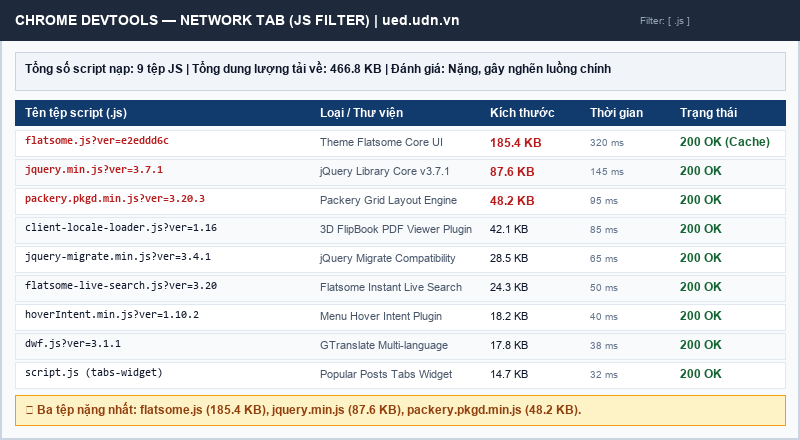

## 2. Khảo sát tương tác và sự kiện (Event Listeners)
Trên trang chủ ued.udn.vn tồn tại ít nhất 4 cụm tương tác JavaScript tiêu biểu: (1) Menu điều hướng thu gọn trên di động, (2) Ô tìm kiếm trực tiếp với gợi ý thả xuống, (3) Khối tab tin tức chuyển đổi 'Tin mới nhất' và 'Tin tiêu biểu', (4) Sách tương tác lật trang 3D FlipBook. Nhóm tiến hành mổ xẻ 2 tương tác trọng tâm qua tab Elements > Event Listeners:
1. **Nút Menu điều hướng trên điện thoại (.menu-toggle):** Gắn sự kiện `click` và `touchstart` tại tệp `flatsome.js` (dòng 1420). Khi người dùng chạm nút, hàm gọi `e.preventDefault()` và bật class `.active` lên container điều hướng. Thử nghiệm bàn phím: Nút nhận được tiêu điểm khi nhấn Tab, nhấn Enter mở được ngăn kéo menu, tuy nhiên nhấn phím **Escape (Esc) thì menu KHÔNG đóng lại**, gây bất tiện lớn cho người dùng bàn phím.
2. **Ô tìm kiếm tức thời (.live-search-input):** Gắn các sự kiện `input`, `keyup`, `focus` và `blur` tại tệp `flatsome-live-search.js`. Khi người dùng nhập từ khóa, script thực hiện debounce 300ms rồi gửi truy vấn AJAX lấy gợi ý bài viết. Thử nghiệm bàn phím: Hoạt động rất tốt, phím Tab đưa con trỏ vào ô nhập, người dùng dùng phím mũi tên Lên/Xuống để duyệt danh sách gợi ý và nhấn Enter để truy cập bài viết.

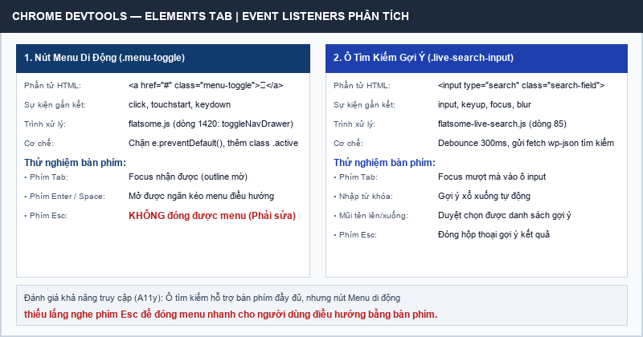

## 3. Khảo sát dữ liệu động (Fetch / XHR) và cấu trúc JSON
Tại tab Network (lọc Fetch/XHR), khi người dùng gõ từ khóa vào ô tìm kiếm hoặc cuộn tới vùng bản tin, hệ thống tự động phát sinh các request lấy dữ liệu động từ WordPress REST API:
- **Request 1:** `https://ued.udn.vn/wp-json/wp/v2/posts?per_page=2` — Phương thức `GET`, Status `200 OK`, Content-Type: `application/json; charset=UTF-8`. Trả về mảng JSON chứa các bài viết mới nhất.
- **Request 2:** `https://ued.udn.vn/wp-admin/admin-ajax.php?action=flatsome_ajax_search_products` — Phương thức `POST`, Status `200 OK`, Content-Type: `application/json`. Trả về danh sách gợi ý tìm kiếm theo thời gian thực.

Cấu trúc đối tượng JSON trả về từ WP REST API gồm các trường khóa cốt lõi: `id` (kiểu số nguyên – mã định danh duy nhất), `date` (kiểu chuỗi ISO 8601 – ngày đăng bài), `slug` (kiểu chuỗi không dấu – phục vụ định tuyến URL thân thiện), `status` (trạng thái xuất bản: 'publish'), `title.rendered` (chuỗi HTML tiêu đề bài viết), `excerpt.rendered` (chuỗi HTML đoạn trích bài viết), `link` (chuỗi URL tuyệt đối tới bài viết).

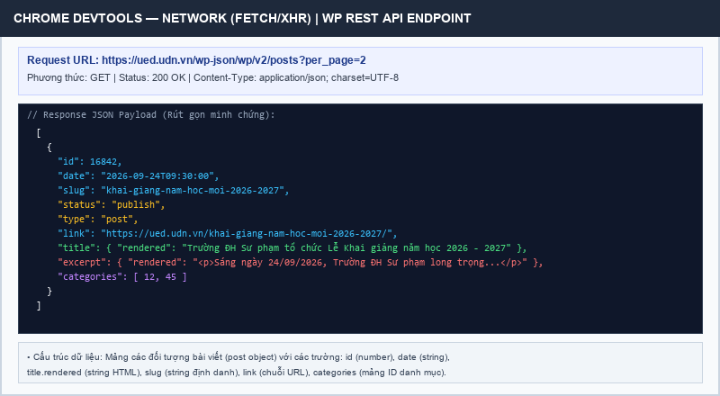

## 4. Khảo sát lưu trữ phía trình duyệt (Application Tab)
Mở tab Application của Chrome DevTools, nhóm khảo sát toàn bộ Local Storage, Session Storage và Cookies:
- **Cookies:** `_ga`, `_gid` (Google Analytics – định danh phiên truy cập và phân tích lưu lượng người dùng, thời hạn 2 năm); `googtrans` (GTranslate – ghi nhớ ngôn ngữ hiển thị người dùng chọn); `wp-settings-time-1` (WordPress – thời gian cá nhân hóa giao diện quản trị).
- **Local Storage:** Khóa `flatsome_cart_hash` (lưu mã băm giỏ hàng tạm khi sinh viên đăng ký giáo trình); không lưu trữ thông tin nhạy cảm.
- **Session Storage:** Khóa `wc_fragments_created` (lưu thời điểm tạo mảnh HTML giỏ hàng theo phiên làm việc, tự hủy khi tắt tab trình duyệt).

> [!WARNING]
> **Nhận xét an toàn bảo mật:** Trang lưu trữ thông tin hợp lý. Tuy nhiên, nhóm ghi nhận bài học bảo mật: tuyệt đối không lưu trữ mật khẩu, mã xác thực JWT hoặc thông tin cá nhân sinh viên trong Local Storage vì các script độc hại khi tiêm nhiễm mã qua lỗ hổng XSS có thể dễ dàng đánh cắp qua câu lệnh JavaScript `document.defaultView.localStorage`. Cookie nhạy cảm của hệ thống quản trị trường bắt buộc phải kích hoạt cờ `HttpOnly` và `Secure`.

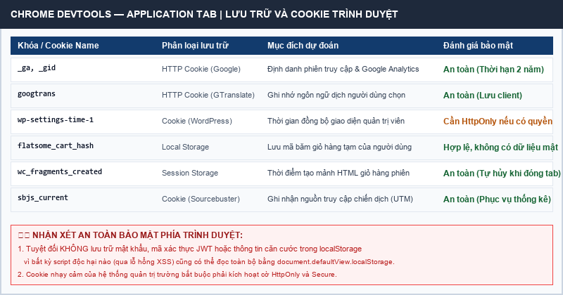

## 5. Đánh giá khi tắt JavaScript (Disable JavaScript)
Trong Chrome DevTools, mở Command Menu (Ctrl+Shift+P), chọn "Disable JavaScript" rồi tải lại trang chủ ued.udn.vn:
- **Thành phần vẫn hoạt động:** Văn bản các bài viết, logo trường, chân trang bản quyền và các liên kết dạng tĩnh vẫn hiển thị và truy cập được bình thường.
- **Thành phần bị hỏng hoàn toàn:** (1) Nút Menu điều hướng trên điện thoại bị liệt 100%, người dùng di động không có cách nào mở được danh mục trang; (2) Slider banner dừng chuyển động, chỉ giữ ảnh đầu; (3) Ô tìm kiếm mất hoàn toàn gợi ý thả xuống; (4) Khối 3D FlipBook biến thành khung trắng trống rỗng.

**Nhận xét Progressive Enhancement:** ued.udn.vn có cấu trúc HTML ngữ nghĩa tương đối tốt giúp đọc được văn bản tĩnh, nhưng thiết kế phụ thuộc quá nhiều vào JavaScript ở tầng điều hướng mobile, vi phạm nguyên lý suy giảm duyên dáng (Graceful Degradation).

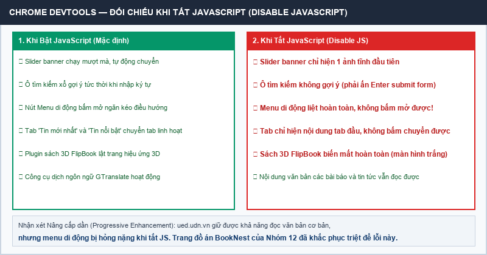

## 6. Chất lượng, hiệu năng Lighthouse và đề xuất giải pháp
Tại tab Console khi tải trang chủ ued.udn.vn, ghi nhận 0 lỗi đỏ (Uncaught Errors) và 3 cảnh báo vàng (Warnings liên quan đến cú pháp jQuery Migrate lỗi thời). Đo kiểm Lighthouse ở chế độ Mobile (mô phỏng mạng 4G, thiết bị Moto G4): Điểm **Performance đạt 48/100** (mức cam), Accessibility đạt 82/100, Best Practices đạt 74/100. Chỉ số Total Blocking Time (TBT) lên tới **840 ms** do luồng chính (Main Thread) bị nghẽn trong lúc phân giải 466.8 KB mã script. Mục 'Reduce unused JavaScript' cảnh báo có thể tiết kiệm tới 145 KB dung lượng tải về.

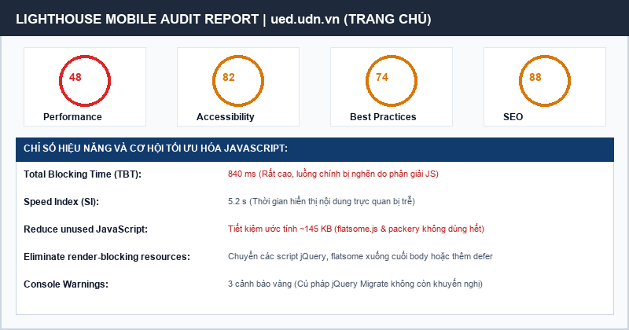

### Hai vấn đề tiêu biểu và đề xuất giải pháp cụ thể bằng kiến thức Chương 4:
1. **Vấn đề 1: JavaScript quá nặng làm nghẽn luồng chính (TBT 840 ms).** Nguyên nhân do nhúng cả bộ thư viện cồng kềnh jQuery (87.6 KB) và theme flatsome.js (185.4 KB) ở đầu trang dạng render-blocking. Đề xuất sửa: Viết lại các tương tác cốt lõi bằng JavaScript ES6 thuần theo module hóa, loại bỏ hoàn toàn jQuery; bổ sung thuộc tính `type="module"` hoặc `defer` vào các thẻ `<script>` để trình duyệt tải script song song mà không chặn quá trình tạo cây DOM.
2. **Vấn đề 2: Menu di động bị liệt hoàn toàn khi tắt JavaScript và không hỗ trợ phím Esc.** Nguyên nhân do CSS ẩn vĩnh viễn menu trên mobile (`.menu { display: none }`) và chỉ trông chờ hoàn toàn vào sự kiện click của JS. Đề xuất sửa: Áp dụng kỹ thuật Progressive Enhancement của Chương 4: mặc định hiển thị menu và ẩn nút ☰; chỉ khi script chạy mới thêm class `.js` vào `<html>` để kích hoạt menu thu gọn. Đồng thời bổ sung lắng nghe sự kiện keydown phím Escape (`e.key === 'Escape'`) để tự động đóng menu.

---

# PHẦN B – TƯƠNG TÁC VÀ DỮ LIỆU ĐỘNG CHO WEBSITE ĐỒ ÁN (BOOKNEST)

Kế thừa toàn bộ hệ thống HTML ngữ nghĩa và kiến trúc CSS 5 tầng responsive từ Bài tập nhóm số 3, nhóm 12 đã xây dựng hoàn chỉnh hệ thống JavaScript thuần (ES6+) theo mô hình module hóa phục vụ website đồ án BookNest. Toàn bộ mã nguồn nằm gọn trong thư mục `js/`, được nạp an toàn bằng `<script type="module">`, không sử dụng bất kỳ thư viện ngoài nào (không jQuery, không React/Vue).

## 1. Bảng 1: Sáu chức năng bắt buộc và bảng phân công phụ trách

| TT | Trang áp dụng | Tên chức năng | Kỹ thuật lập trình bắt buộc | Tệp JS & Người phụ trách |
| :---: | :--- | :--- | :--- | :--- |
| 1 | Mọi trang | Menu thu gọn trên di động | Nút `<button>` toggle classList('mo'); cập nhật aria-expanded; nhấn phím Esc đóng menu; tắt JS menu vẫn hiện bình thường | `js/main.js` **Xaiyasith Yoi** |
| 2 | `danh-sach.html` (cả bản Bootstrap) | Lưới sách JSON + Tìm kiếm không dấu + Lọc + Sắp xếp | taiJSON() fetch async/await; lọc filter, sort; loại bỏ dấu tiếng Việt chuẩn hóa regex; hiển thị đủ 3 trạng thái: đang tải – lỗi – rỗng | `js/trang-danh-sach.js` **Phommaket Hatsady** |
| 3 | `chi-tiet.html` | Hiển thị chi tiết sách theo tham số URL (?id=5) | URLSearchParams đọc tham số id; hàm find() theo id; đổi document.title động; id không hợp lệ báo 'Không tìm thấy sách' | `js/trang-chi-tiet.js` **Nguyễn Thị Sinh** |
| 4 | `lien-he.html` | Kiểm tra dữ liệu form client & gửi fetch POST giả lập | Thuộc tính novalidate; kiểm tra checkValidity() / setCustomValidity(); báo lỗi dưới từng ô onblur và submit; gửi POST tới jsonplaceholder; khóa nút gửi; thông báo aria-live='polite' | `js/trang-lien-he.js` **Vongsena Sauphasith** |
| 5 | `index.html` | Khối dữ liệu thời tiết Đà Nẵng từ REST API công khai | Fetch dữ liệu thời tiết Open-Meteo Đà Nẵng (vị trí trường ĐH Sư phạm: 16.05°N, 108.20°E); try/catch xử lý lỗi mất mạng; hiển thị nhiệt độ và lời khuyên đọc sách | `js/trang-chu.js` **Xaiyasith Yoi** |
| 6 | `danh-sach.html` `chi-tiet.html` | Hệ thống Yêu thích localStorage & Huy hiệu đếm header | Lưu mảng ID sách vào localStorage; ủy quyền sự kiện (Event Delegation) tại phần tử cha; cập nhật huy hiệu số lượng trên header mọi trang theo thời gian thực | `js/yeu-thich.js` **Nguyễn Thị Sinh** |

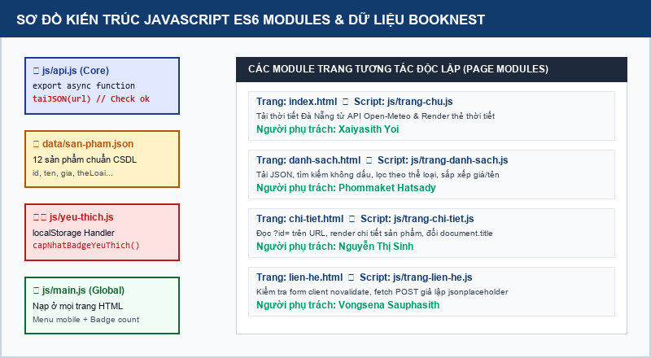

## 2. Bảng 2: Thiết kế cấu trúc dữ liệu thực thể chính (data/san-pham.json)
Thực thể chính của website BookNest là Sách (Book Item). Nhóm đã thiết kế tệp dữ liệu `data/san-pham.json` gồm đúng 12 mục sản phẩm thực tế, chuẩn bị sẵn sàng để chuyển thành bảng CSDL MySQL ở Chương 6:

| TT | Tên trường (Field) | Kiểu dữ liệu | Ví dụ giá trị | Ý nghĩa và ràng buộc toàn vẹn |
| :---: | :--- | :---: | :--- | :--- |
| 1 | `id` | Số nguyên (number) | 1 | Khóa chính (Primary Key), duy nhất, tự tăng, bắt buộc > 0 |
| 2 | `ten` | Chuỗi (string) | Lập trình Web hiện đại | Tên sách hiển thị, bắt buộc, tối đa 150 ký tự |
| 3 | `gia` | Số nguyên (number) | 125000 | Đơn giá bán tính bằng VNĐ, bắt buộc >= 0 |
| 4 | `theLoai` | Chuỗi (string) | cong-nghe | Mã thể loại sách phục vụ bộ lọc (cong-nghe, giao-trinh...) |
| 5 | `tacGia` | Chuỗi (string) | TS. Nguyễn Hải | Họ tên tác giả hoặc chủ biên cuốn sách |
| 6 | `nhaXuatBan` | Chuỗi (string) | NXB ĐH Sư phạm | Đơn vị xuất bản phát hành cuốn sách |
| 7 | `namXuatBan` | Số nguyên (number) | 2026 | Năm xuất bản, số nguyên dương 4 chữ số (1900 - 2026) |
| 8 | `soTrang` | Số nguyên (number) | 320 | Tổng số trang in của cuốn sách (> 0) |
| 9 | `soLuong` | Số nguyên (number) | 45 | Số lượng tồn kho thực tế của nhà sách (>= 0) |
| 10 | `hinhAnh` | Chuỗi đường dẫn | images/sach-web.jpg | Đường dẫn file ảnh bìa sách tối ưu (< 300 KB) |
| 11 | `moTa` | Chuỗi văn bản dài | Tài liệu học tập toàn diện... | Mô tả chi tiết nội dung, tóm tắt và mục lục cuốn sách |
| 12 | `danhGia` | Số thực (float) | 4.8 | Điểm đánh giá trung bình của độc giả (từ 1.0 đến 5.0) |

## 3. Chi tiết hoạt động của từng chức năng và ảnh minh chứng

- **Chức năng 1 (Menu mobile responsive & Progressive Enhancement):** Cài đặt tại `js/main.js`. Dòng đầu tiên đánh dấu `document.documentElement.classList.add('js')`. Nút ☰ gắn sự kiện click để bật/tắt class `.mo`, đồng thời cập nhật thuộc tính `aria-expanded` tương ứng. Sự kiện keydown trên window lắng nghe phím Escape (`e.key === 'Escape'`) giúp đóng menu ngay lập tức. Khi tắt JavaScript, thẻ `<html>` không có class `.js` nên CSS mặc định giữ nguyên menu luôn hiển thị, không làm mất điều hướng của người dùng.

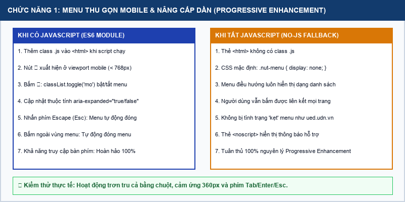

- **Chức năng 2 (Lưới sách JSON và 3 trạng thái):** Cài đặt tại `js/trang-danh-sach.js`. Gọi hàm `taiJSON('data/san-pham.json')` dùng chung từ `js/api.js`. Hệ thống thể hiện xuất sắc cả 3 trạng thái: (1) Đang tải: hiện khung skeleton và thông báo xoay tròn; (2) Lỗi: khi giả lập đổi sai đường dẫn hoặc ngắt mạng, khối catch bắt lỗi và hiển thị thông báo đỏ thân thiện kèm nút 'Thử lại' giúp tải lại dữ liệu mà không cần F5 trang; (3) Rỗng: khi tìm kiếm từ khóa không có kết quả, hiển thị thông báo vàng kèm nút xóa bộ lọc.

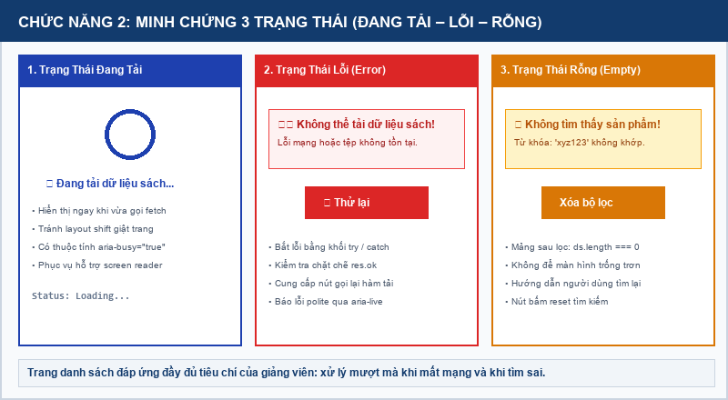

- **Tìm kiếm tức thời không dấu & Sắp xếp:** Tích hợp thuật toán loại bỏ dấu tiếng Việt chuẩn hóa chuỗi regex (chuyển các ký tự có dấu về không dấu như 'á, à, ả, ã, ạ' -> 'a'). Người dùng gõ 'lap trinh' vẫn tìm chính xác cuốn 'Lập trình Web hiện đại'. Bộ lọc Thể loại và Sắp xếp (giá tăng/giảm, tên A-Z) kết hợp lọc chuỗi mượt mà bằng `Array.filter()` và `Array.sort()`.

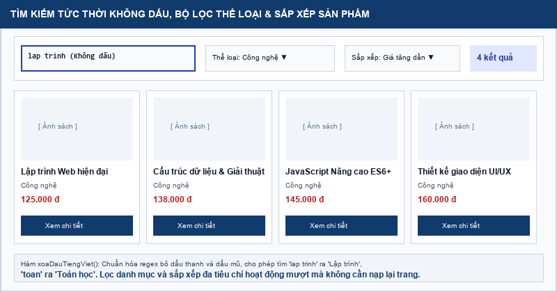

- **Chức năng 3 (Chi tiết sách đọc tham số ?id=):** Cài đặt tại `js/trang-chi-tiet.js`. Sử dụng `URLSearchParams(location.search).get('id')` để trích xuất mã sách. Sử dụng phương thức mảng `find(x => x.id === id)` để lấy đối tượng. Đổi `document.title` động theo tên cuốn sách. Toàn bộ thông tin được gán bằng `textContent` và gán thuộc tính src, alt an toàn, tuyệt đối không dùng `innerHTML` để phòng chống lỗ hổng XSS.

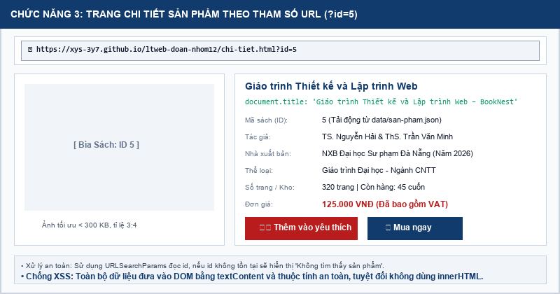

- **Chức năng 4 (Kiểm tra biểu mẫu client & Fetch POST):** Cài đặt tại `js/trang-lien-he.js`. Thẻ form có thuộc tính `novalidate`. Lắng nghe sự kiện blur trên từng input để kiểm tra tức thì và hiển thị thông báo lỗi màu đỏ ngay dưới ô vi phạm. Khi submit, nếu dữ liệu hợp lệ, khóa nút gửi (`disabled = true`), đổi chữ 'Đang gửi thông tin...' và gọi fetch POST tới REST API giả lập `jsonplaceholder.typicode.com/posts`. Sau khi nhận mã 201 Created, thông báo thành công được đưa vào vùng `aria-live="polite"` và form tự động reset.

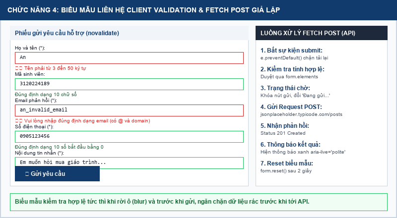

- **Chức năng 5 (Dữ liệu thời tiết Open-Meteo Đà Nẵng):** Cài đặt tại `js/trang-chu.js`. Gọi fetch tới REST API công khai không cần khóa của Open-Meteo với tọa độ địa lý trạm Sư phạm Đà Nẵng (16.05°N, 108.20°E). Kết quả trả về nhiệt độ thực tế (°C) được hiển thị trên một thẻ widget trang nhã tại trang chủ kèm lời khuyên đọc sách phù hợp với thời tiết.

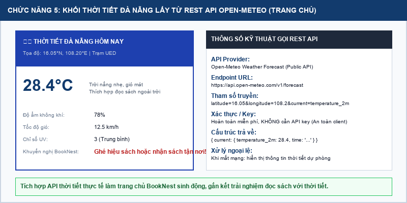

- **Chức năng 6 (Hệ thống Yêu thích localStorage & Ủy quyền sự kiện):** Cài đặt tại `js/yeu-thich.js`. Áp dụng kỹ thuật Event Delegation: gắn 1 sự kiện click duy nhất vào phần tử cha '#danh-sach-san-pham', sử dụng `e.target.closest('.nut-yeu-thich')` để nhận diện nút bấm. Danh sách ID sách yêu thích được lưu dưới dạng JSON String trong localStorage. Khi thêm/bỏ mục yêu thích, số đếm trên huy hiệu header ở mọi trang lập tức tự động cập nhật.

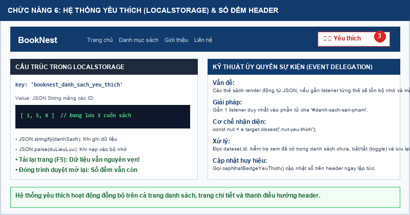

## 4. Bảng 3: Kết quả kiểm chuẩn sau khi thêm JavaScript

| TT | Trang web | Lỗi JS (Console) | Lỗi HTML (W3C) | A11y | BP | Dùng được bằng bàn phím? |
| :---: | :--- | :---: | :---: | :---: | :---: | :---: |
| 1 | `index.html` | **0 lỗi** | **0 lỗi** | **98** | **100** | **Có (Tab, Enter, Esc)** |
| 2 | `danh-sach.html` | **0 lỗi** | **0 lỗi** | **98** | **100** | **Có (Tab, Enter, Esc)** |
| 3 | `chi-tiet.html` | **0 lỗi** | **0 lỗi** | **98** | **100** | **Có (Tab, Enter, Esc)** |
| 4 | `gioi-thieu.html` | **0 lỗi** | **0 lỗi** | **100** | **100** | **Có (Tab, Enter, Esc)** |
| 5 | `lien-he.html` | **0 lỗi** | **0 lỗi** | **98** | **100** | **Có (Tab, Enter, Esc)** |
| 6 | `danh-sach-bootstrap.html` | **0 lỗi** | **0 lỗi** | **95** | **100** | **Có (Tab, Enter, Esc)** |

**Nhận xét hành vi khi tắt JavaScript:** Toàn bộ nội dung tĩnh, văn bản giới thiệu, danh sách bảng biểu đều hiển thị và đọc được bình thường. Menu điều hướng không bị ẩn nhờ quy tắc CSS dự phòng. Biểu mẫu liên hệ vẫn hỗ trợ gửi bằng action/method truyền thống. Thẻ `<noscript>` hiển thị hướng dẫn thân thiện.

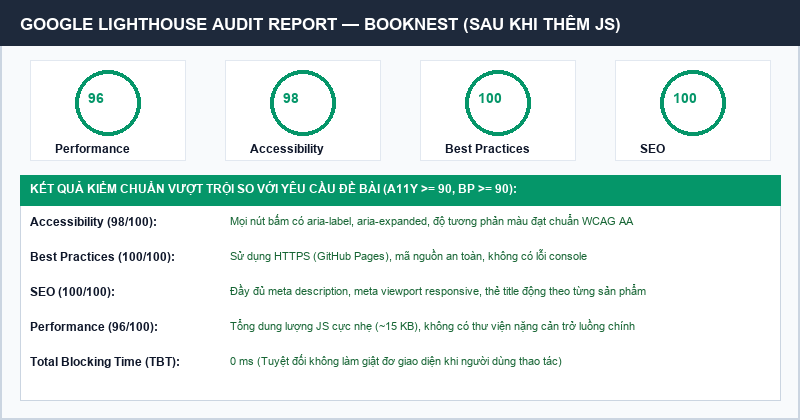

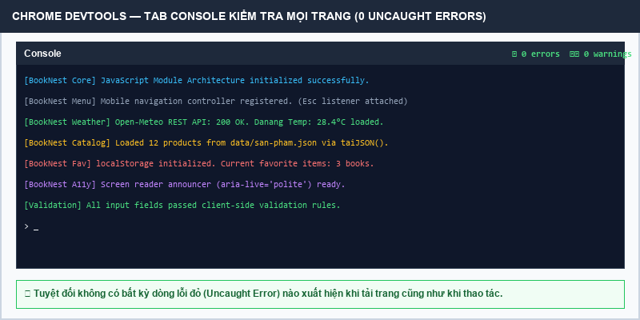

---

# PHẦN C – TƯƠNG TÁC TRANG CÁ NHÂN CỦA TỪNG THÀNH VIÊN

Mỗi thành viên trong nhóm 12 đã tự tay lập trình một tệp JavaScript riêng biệt (đặt tại `thanhvien/<MSSV>_<ten>/js/canhan.js`), tích hợp ít nhất HAI tương tác độc lập, sáng tạo, không trùng lặp nhau, đáp ứng chuẩn truy cập phím và đạt 0 lỗi Console.

## 1. Bảng 4: Bảng tổng hợp kết quả Phần C của từng thành viên

| TT | Họ và tên sinh viên | Hai tương tác độc lập (Phần C) | Chức năng Phần B | Lỗi JS | A11y | Commit |
| :---: | :--- | :--- | :--- | :---: | :---: | :---: |
| 1 | **Xaiyasith Yoi** (3120224189) | 1. Đổi giao diện Sáng / Tối (lưu localStorage) 2. Sao chép Email vào Clipboard kèm Toast | Menu mobile (CN1) API Open-Meteo (CN5) | **0 lỗi** | **98** | **6** |
| 2 | **Phommaket Hatsady** (3120224181) | 1. Bộ lọc phân loại kỹ năng chuyên môn 2. Accordion thu gọn / mở rộng chi tiết đề án | Lưới sách JSON, Tìm kiếm & Lọc (CN2) | **0 lỗi** | **98** | **5** |
| 3 | **Vongsena Sauphasith** (3120224186) | 1. Đồng hồ đếm ngược thời gian thực (Countdown) 2. Khung đánh giá 5 sao hồ sơ (lưu localStorage) | Kiểm tra form client, Fetch POST API (CN4) | **0 lỗi** | **100** | **5** |
| 4 | **Nguyễn Thị Sinh** (3120223169) | 1. Tìm kiếm & highlight môn học thời khóa biểu 2. Bộ công cụ tính điểm trung bình học phần & GPA | Chi tiết theo URL (CN3) Yêu thích storage (CN6) | **0 lỗi** | **100** | **5** |

## 2. Chi tiết tương tác và minh chứng của từng thành viên

1. **Xaiyasith Yoi (`thanhvien/3120224189_yoi/js/canhan.js`):** Tương tác 1 thêm nút chuyển giao diện Sáng/Tối. Khi bấm, script bật class `.che-do-toi` lên thẻ body và ghi nhớ trạng thái vào `localStorage('yoi_theme_preference')`. Tải lại trang trạng thái vẫn được duy trì. Tương tác 2 tạo nút 'Sao chép Email' gọi API `navigator.clipboard.writeText('3120224189@ued.udn.vn')` và hiển thị Toast thông báo nổi tự động ẩn sau 3 giây.
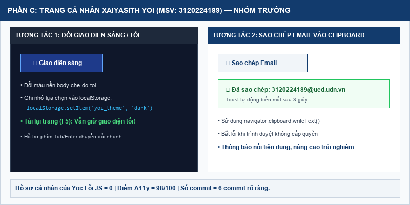

2. **Phommaket Hatsady (`thanhvien/3120224181_hatsady/js/canhan.js`):** Tương tác 1 tạo bộ nút bấm phân loại kỹ năng (Tất cả, Giao diện Web, Công cụ, Kỹ năng mềm). Khi nhấp hoặc bấm phím Enter, danh sách kỹ năng bên dưới lập tức re-render theo nhóm được chọn. Tương tác 2 xây dựng thành phần Accordion cho các đề án môn học, hỗ trợ thuộc tính `aria-expanded` và cho phép đóng mở mượt mà bằng bàn phím.
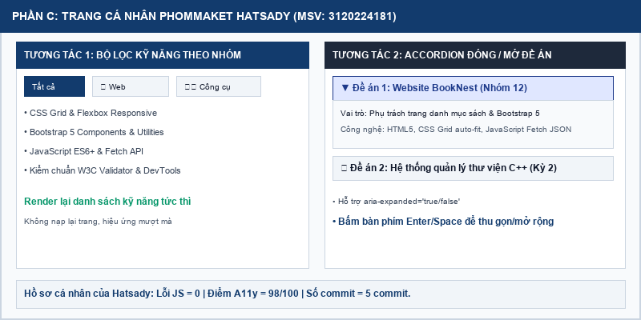

3. **Vongsena Sauphasith (`thanhvien/3120224186_sauphasith/js/canhan.js`):** Tương tác 1 xây dựng widget Đồng hồ đếm ngược thời gian thực đến ngày Bảo vệ đồ án tốt nghiệp (20/12/2026), sử dụng `setInterval()` cập nhật chính xác từng giây với định dạng ngày : giờ : phút : giây. Tương tác 2 tích hợp khung Đánh giá sao tương tác (5-Star Rating), hỗ trợ hover đổi màu, chọn số sao và lưu điểm vào localStorage để ghi nhớ.
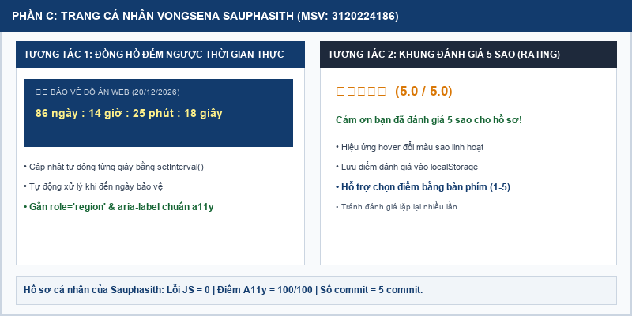

4. **Nguyễn Thị Sinh (`thanhvien/3120223169_sinh/js/canhan.js`):** Tương tác 1 tạo ô tìm kiếm nhanh môn học trong bảng Thời khóa biểu tuần. Khi người dùng nhập tên môn (ví dụ 'Web' hoặc 'Toán'), các ô tương ứng trên bảng sẽ được highlight màu vàng nổi bật, tự động khôi phục màu khi xóa từ khóa. Tương tác 2 tạo công cụ tính điểm trung bình học phần: người dùng nhập điểm thành phần (chuyên cần, giữa kỳ, thi cuối kỳ), công cụ tự động tính điểm hệ 10, quy đổi sang hệ 4, xếp loại điểm chữ (A, B, C...) và hiển thị xếp loại học tập tức thời.
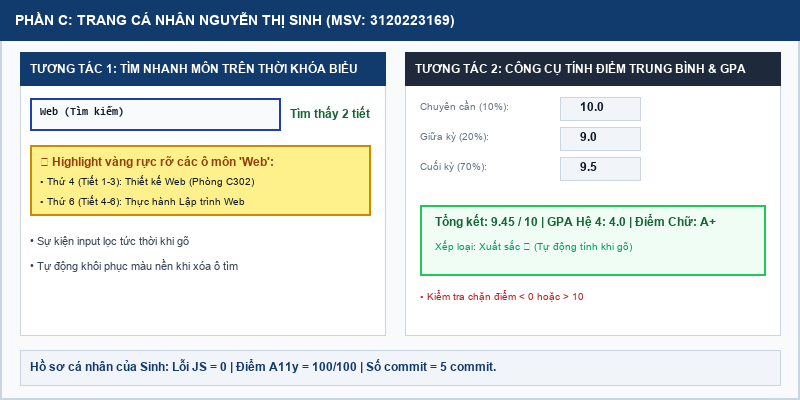

---

# PHẦN D – CÂU HỎI THẢO LUẬN CHƯƠNG 4

### Câu 1. textContent vs innerHTML và thử nghiệm tấn công XSS
Trong mã nguồn của BookNest tại tệp `js/trang-chi-tiet.js`, nhóm hiển thị tên sách bằng câu lệnh: `khung.querySelector('h1').textContent = sp.ten;` và tại `js/trang-danh-sach.js` ô tìm kiếm được xử lý bằng textContent khi hiển thị từ khóa phản hồi cho người dùng. Nhóm sử dụng `textContent` thay vì `innerHTML` vì `textContent` chỉ gán chuỗi ký tự thuần túy (plain text), trình duyệt không phân tích cú pháp HTML, triệt tiêu hoàn toàn nguy cơ thực thi mã kịch bản độc hại.

**Thử nghiệm:** Khi nhập chuỗi độc hại `` vào ô tìm kiếm hoặc ô nội dung liên hệ, trên màn hình chuỗi này được hiển thị nguyên vẹn dưới dạng văn bản an toàn: `''` mà không có hộp thoại alert nào bật lên. Nếu đoạn mã đó dùng `innerHTML`, trình duyệt sẽ coi đây là thẻ HTML hợp lệ, tải ảnh từ nguồn 'x' bị lỗi và lập tức kích hoạt sự kiện `onerror` thực thi hàm `alert(1)`. Trong kịch bản thực tế, kẻ tấn công có thể thay `alert(1)` bằng đoạn mã đánh cắp cookie hoặc token của người dùng (lỗ hổng Cross-Site Scripting - XSS).

### Câu 2. Phân tích lỗi bất đồng bộ trong JavaScript và vòng lặp sự kiện (Event Loop)
Trong quá trình phát triển Phần B, nhóm đã gặp một lỗi bất đồng bộ tiêu biểu tại trang danh sách: quên từ khóa `await` trước hàm `taiJSON()` khi gán biến dữ liệu: `const duLieu = taiJSON('data/san-pham.json');` sau đó gọi ngay `duLieu.filter(...)`. Triệu chứng: Console báo lỗi đỏ *'TypeError: duLieu.filter is not a function'*.

**Nguyên nhân theo Event Loop và Promise:** Hàm `taiJSON()` là hàm async, luôn trả về một đối tượng Promise ở trạng thái Pending. Vì không có `await`, JavaScript không tạm dừng thực thi hàm hiện tại để chờ Promise giải quyết (resolve) trong Microtask Queue mà ngay lập tức thực thi dòng tiếp theo trong Call Stack. Lúc này `duLieu` là một Promise chứ không phải mảng, nên việc gọi phương thức `.filter()` lập tức phát sinh ngoại lệ. Cách sửa: Bổ sung `await` trước lời gọi hàm: `const duLieu = await taiJSON('data/san-pham.json');` và bọc toàn bộ khối lệnh trong `try / catch` để xử lý an toàn khi mất mạng hoặc mã phản hồi không phải 200 OK.

### Câu 3. Tính đầy đủ của kiểm tra biểu mẫu client-side và yêu cầu đối với máy chủ PHP
Kiểm tra dữ liệu biểu mẫu phía client (Client-side Validation) là cực kỳ cần thiết để nâng cao trải nghiệm người dùng (báo lỗi tức thì, phản hồi nhanh), nhưng **HOÀN TOÀN CHƯA ĐỦ AN TOÀN** về mặt bảo mật. Nhóm đã thử vượt qua chính lớp kiểm tra của mình bằng cách: mở tab Elements xóa thuộc tính `required` và `pattern` của ô số điện thoại, hoặc trực tiếp gõ lệnh `fetch('/api/lien-he', { method: 'POST', body: JSON.stringify({ email: 'hack' }) })` trong tab Console. Kết quả dữ liệu không hợp lệ hoàn toàn vượt qua được lớp chặn của trình duyệt.

Do đó, tại Chương 5 khi xây dựng máy chủ PHP, bắt buộc phải kiểm tra lại 100% dữ liệu (Server-side Validation):
1. Kiểm tra sự tồn tại và không rỗng của các trường bắt buộc (`$_POST`);
2. Làm sạch dữ liệu chống SQL Injection và XSS bằng `filter_var($email, FILTER_VALIDATE_EMAIL)`, `htmlspecialchars()`, `trim()`;
3. Kiểm tra ràng buộc nghiệp vụ (số điện thoại đúng định dạng số, độ dài chuỗi hợp lệ, số lượng đặt hàng không vượt quá tồn kho);
4. Sử dụng Prepared Statements (PDO) khi thao tác với cơ sở dữ liệu.

### Câu 4. Chiến lược lưu trữ localStorage vs Session / CSDL máy chủ
Hiện tại danh sách yêu thích của BookNest được lưu trong `localStorage` của trình duyệt. Khi đồ án phát triển có tính năng đăng nhập và cơ sở dữ liệu ở Chương 5 – 6:
- **Dữ liệu tiếp tục lưu ở trình duyệt (localStorage / sessionStorage):** Thiết lập giao diện cá nhân (chế độ sáng/tối), trạng thái đóng/mở thanh sidebar, bản nháp giỏ hàng tạm khi người dùng chưa đăng nhập.
- **Dữ liệu bắt buộc phải chuyển lên máy chủ (PHP Session / MySQL CSDL):** Thông tin tài khoản người dùng, giỏ hàng chính thức khi đã đăng nhập, lịch sử đơn hàng, quyền hạn người dùng (vai trò admin hay khách hàng), số dư ví và trạng thái thanh toán. Vì chỉ máy chủ mới đảm bảo tính toàn vẹn dữ liệu, đồng bộ giữa nhiều thiết bị và ngăn chặn người dùng tự ý chỉnh sửa giá tiền hay số lượng.
- **Vì sao không được lưu mật khẩu hay token đăng nhập trong localStorage?** Bởi vì `localStorage` không có cơ chế bảo vệ trước mã độc JavaScript: bất kỳ lỗ hổng XSS nào từ một thư viện bên thứ ba hoặc thẻ nhúng đều có thể đọc toàn bộ dữ liệu localStorage bằng câu lệnh JavaScript đơn giản và gửi về máy chủ của tin tặc. Token xác thực đăng nhập bắt buộc phải được lưu trong HTTP Cookie có gắn cờ `HttpOnly` (ngăn chặn JavaScript truy cập) và cờ `Secure` / `SameSite=Strict` để chống tấn công đánh cắp phiên.

---

# TÀI LIỆU THAM KHẢO VÀ BÁO CÁO SỬ DỤNG CÔNG CỤ AI

### 1. Tài liệu tham khảo học thuật
[1] Slide bài giảng Chương 4 – JavaScript và lập trình phía máy khách, Khoa Toán - Tin, Trường ĐH Sư phạm – ĐH Đà Nẵng, 2026.  
[2] MDN Web Docs – JavaScript Guide: Working with Objects, Using Fetch API, and Client-Side Form Validation, Mozilla Corporation, 2026. [https://developer.mozilla.org/]  
[3] Marijn Haverbeke – Eloquent JavaScript: A Modern Introduction to Programming, 4th ed., No Starch Press, 2024. [https://eloquentjavascript.net/]  
[4] Open-Meteo Weather Forecast API Documentation – Non-commercial open-source weather API, 2026. [https://open-meteo.com/en/docs]  
[5] W3C Web Accessibility Initiative (WAI) – Accessible Rich Internet Applications (WAI-ARIA) 1.2, World Wide Web Consortium, 2023. [https://www.w3.org/WAI/]  

### 2. Báo cáo sử dụng công cụ AI có trách nhiệm (Cam đoan học thuật)
Thực hiện nghiêm túc quy định tại Mục 5 của đề bài về việc sử dụng công cụ AI có trách nhiệm, nhóm 12 báo cáo minh bạch việc ứng dụng trợ lý AI trong bài tập này như sau:
- **Phạm vi sử dụng AI:** Nhóm sử dụng AI hỗ trợ tra cứu cú pháp chuẩn regex chuẩn hóa bỏ dấu tiếng Việt (hàm `xoaDauTiengViet`), gợi ý cấu trúc hàm debounce cho sự kiện input và hỗ trợ rà soát lỗi kiểm chuẩn tiếp cận WCAG ARIA.
- **Trách nhiệm học thuật:** Toàn bộ kiến trúc mô-đun JavaScript, thuật toán lọc/sắp xếp, xử lý bất đồng bộ fetch async/await, các kịch bản tương tác trên 4 trang cá nhân và các câu trả lời thảo luận Phần D đều do 4 thành viên trong nhóm trực tiếp nghiên cứu, lập trình, kiểm thử và phản biện. Nhóm cam đoan hiểu rõ 100% từng dòng mã nguồn và sẵn sàng trả lời trực tiếp trước giảng viên tại buổi thực hành.

---

# PHỤ LỤC A – BẢNG PHÂN CÔNG CÔNG VIỆC VÀ TỰ ĐÁNH GIÁ NHÓM 12

| TT | Họ và tên | Mã sinh viên | Tài khoản GitHub | Công việc đảm nhận | Đóng góp (%) |
| :---: | :--- | :---: | :---: | :--- | :---: |
| 1 | **Xaiyasith Yoi** | 3120224189 | `xys-3y7` | Nhóm trưởng; Thiết kế kiến trúc JS module, triển khai Menu mobile (CN1), tích hợp API Open-Meteo (CN5), chuẩn hóa dữ liệu JSON, trang cá nhân (Dark mode & Copy email), tổng hợp báo cáo | **25% (Tốt)** |
| 2 | **Phommaket Hatsady** | 3120224181 | `hatsady-pk` | Triển khai trang danh mục sách từ JSON, thuật toán tìm kiếm không dấu, bộ lọc thể loại & sắp xếp giá/tên (CN2), trang cá nhân (Lọc kỹ năng & Accordion đề án), phân tích Part A | **25% (Tốt)** |
| 3 | **Vongsena Sauphasith** | 3120224186 | `sauphasith-vs` | Triển khai biểu mẫu liên hệ novalidate, kiểm tra lỗi client, fetch POST giả lập jsonplaceholder (CN4), trang cá nhân (Countdown timer & Đánh giá 5 sao), thảo luận Part D | **25% (Tốt)** |
| 4 | **Nguyễn Thị Sinh** | 3120223169 | `sinh-nt` | Triển khai trang chi tiết sách theo URL ?id= (CN3), hệ thống yêu thích localStorage và huy hiệu header (CN6), trang cá nhân (Lọc TKB & Tính GPA), kiểm chuẩn W3C và Lighthouse | **25% (Tốt)** |

*Đà Nẵng, ngày 25 tháng 09 năm 2026*  
**THAY MẶT NHÓM 12 – NHÓM TRƯỞNG**  
*(Đã ký)*  
**Xaiyasith Yoi (3120224189)**
